# Couch Tour — Product Roadmap

This document outlines the product vision, recently completed milestones, prioritized feature backlog, and open design questions for **Couch Tour** across Android, macOS, and the Cloudflare sync backend.

Historical implementation details and architectural choices are logged separately in [DECISIONS.md](DECISIONS.md).

---

## Current Status Overview

- **Android Client**: Full-featured native app (Jetpack Compose, Media3, Room, Android Auto) supporting the complete phish.in and Relisten catalog (~200+ artists), personal library (likes, local playlists, favorites, on-this-date discovery, next tour stop), filler-track skipping, playback history, and listened/completion indicators.
- **macOS Client**: Native SwiftUI + AVFoundation app matching Android's core browse, playback, source switching, search, inspector, settings, filler-track skipping, and full personal library parity (login, likes, favorites, cross-backend local playlists).
- **Sync Backend**: Cloudflare Worker + D1 live in production (`https://couch-tour-sync.mkastellec.workers.dev`), syncing playback progress, history, and resume positions across paired devices with QR pairing, token rotation, and 180-day tombstone cleanup.

---

## Completed Milestones

### 1. Multi-Artist Catalog & Core Playback (Shipped)
- **Multi-Artist Support via Relisten**: Full access to ~200+ artists alongside phish.in with backend-neutral catalog abstractions ([MULTI-ARTIST-PLAN.md](MULTI-ARTIST-PLAN.md), D74–D82).
- **Source / Tape Picker**: Reworked tape switching into an etree-style Source sheet/popover with SBD/Matrix heuristics, ratings, taper notes, and lineage on Android (#17, #37) and macOS (#25, D168).
- **Filler Track Skipping**: Configurable persistent toggle on Android and macOS to bypass tuning, intro/outro banter, crowd chatter, and announcements during playback (#49, D178).
- **Listened Track & Show Completion Indicators**: Visual checkmarks for tracks listened to $\ge 90\%$ and completed show badges (#83, D182).
- **Android Auto Support**: Full MediaLibraryService browse hierarchy for phish.in and Relisten with car Continue Listening support (#5, P8, D73).
- **FLAC Streaming Support**: Lossless FLAC playback preferred over MP3 on Android and macOS, with a Cast-time MP3 rewrite for stock receiver compatibility and codec badges across Now Playing surfaces (#27, D187, D189).

### 2. Personal Library & Account Parity (Shipped)
- **Favorite Artists**: Star toggle and pinned favorites section on Android (#14, #38) and macOS (#56, #75).
- **phish.in Account Integration**: Login, session management, and server-side likes on Android and macOS (#57, #77).
- **Relisten Track Likes**: Fast, account-free local likes for Relisten tracks on Android (#11, #40) and macOS (#58, #78).
- **Cross-Backend Local Playlists**: Local mixtape playlists mixing phish.in and Relisten tracks with parallelized track resolution on Android (#12, #41, D161, D175) and macOS (#59, #80, #81, D175).

### 3. Discovery & Browse Enhancements (Shipped)
- **Home Screen "On This Date"**: Anniversary shows across favorited artists with backend-bounded request batching and caching (#13, #42, D162).
- **"Next Couch Tour Stop"**: Automatic discovery of unplayed shows on active tours for favorited artists (#22, #46, D164, D165).
- **"Next Stop" Tour/Era Picker for Defunct Artists**: Lets users pick a past tour or era to track for bands that no longer tour, rather than a strict opt-out (#68, D190).
- **Browse by Top Rated / Popular**: phish.in "Popular" synthetic period sorted by server likes; Relisten period-level `avg_rating` sort filter (#21, #33, D158–D159).
- **"Surprise Me" Random Show**: Full merged catalog random show selector (#20, #32, D157).
- **Universal Search**: Multi-artist search across artists, shows, songs, and venues on Android and macOS (#25, D169).
- **Social Sharing**: Share sheets for shows and tracks resolving to canonical phish.in and relisten.net web URLs (#19, #31, D155–D156).

### 4. Cross-Platform Sync & Reliability (Shipped)
- **End-to-End Progress Sync**: Real-time progress, history, and resume sync with last-write-wins conflict resolution (D116–D143).
- **Sync Usability & QR Pairing**: QR code pairing generator and scanner, low-latency debounced pushes, and automated tombstone purge (D144, D147, D148).
- **Sync Resilience & Diagnostics**: UI error surfacing (`lastError`), Android Keystore reset recovery, macOS background sync reactive refresh, and connection-reuse timing instrumentation (D172, D173, D174, D176).
- **Security Audit**: Rate limiting, parameterized D1 queries, and secure credential storage verified (#26, D150–D154).

### 5. Desktop (macOS) UI & Native Experience (Shipped)
- **Player Surface & Inspector**: Trailing Now Playing inspector panel, track queue, high-res artwork caching, and persistent app volume control (#25, D167).
- **Menu Bar & Keyboard Transport**: Native menu commands and bare Space hotkey monitor for global play/pause (#25, D166, #84, D177).
- **Settings Scene & History Filters**: Dedicated Settings window (⌘,) and artist-filtered listening history (#25, D171).
- **Unobtrusive App Version**: Build version indicators displayed in headers and settings across both clients (#43, D163, D181).

### 6. Polish, Library & Usability Parity (Shipped — Phase 1)
- **Local Playlist Editing (Rename & Reorder)**: Rename local playlists and manually reorder tracks via Drag-and-Drop `.onMove` and Move Up/Down controls on Android and macOS (#69, D184).
- **Now Playing Track Likes**: Heart/like action surfaced directly on Now Playing and persistent MiniPlayer for phish.in and Relisten across Android and macOS (#63, D183).
- **Live Sync Device List Refresh**: 5-second periodic polling and on-demand refresh buttons on Android and macOS Sync screens (#64, D185).
- **Unified Android Auto Catalog**: Android Auto browse tree unified to the merged artist catalog (Phish, favorites, Relisten bands) (#28, D186).
- **Native Feedback Launcher**: Direct in-app GitHub issue submission with pre-populated device/environment metadata (#87, D180).

### 7. Desktop Power & Distribution (Shipped — Phase 2 Batch 3)
- **Desktop Cast & AirPlay Sender Support**: Google Cast sender integration via Bonjour mDNS and TLS V2 channels with remote queue management, transport controls, and AirPlay output picker (#10, D196).

### 8. Ledger Design System & Visual Handoff Parity (Shipped — D214, D215, D218, D224, D225)
- **Unified Design Tokens**: Dark (`#161826`) and light (`#ffffff` / `#f7f7fb`) token foundations, 4-stop stagelight hairline gradient, procedural cover-art gradient, and artist abbreviation helpers preserving `uat-005` ("moe." lowercase with period) and `uat-006` (`YYYY-MM-DD` date formatting).
- **Android Client Parity (Screens 1A–1E)**: Top ledger bar with live date and "Surprise Me" shuffle, horizontal card shelves for In-Progress (with top 2px progress bar overlay), Next Tour Stops (with top gradient accent bar), and On This Date. Fixed-width 44dp type badges (`LIST`, `SHOW`, `TRACK`), search tabs with count pills, collapsible Jam Chart notes, ambient radial artwork glow, and vector dual-layer waveform scrubber (`DesignComponents.kt`, `NowPlaying.kt`, `MainActivity.kt`).
- **macOS Desktop 3-Pane & Expanded Player (Screens 2A–2E)**: Window traffic lights chrome, left sidebar with active `#d2cefd` highlight and live favorite artist show counts, right player rail with 3-radial wash, conic glow artwork, Jam Chart note card, and 64px waveform scrubber. Expanded 1440×900 Now Playing modal with 440px artwork and 110px scrubber. 2-column show detail setlist layout with compact durations and active track highlight bar, and fixed-column desktop library table (`LedgerDesign.swift`, `SidebarView.swift`, `PlayerRailView.swift`, `ExpandedNowPlayingView.swift`, `ShowDetailView.swift`, `LocalPlaylistsView.swift`).
- **UI Wiring, Navigation & Mock Data Audit (Shipped — D218, #139–#149)**: Comprehensive audit across Android and macOS wiring search filter categories with live item count pills, interactive library sort dropdowns, live offline storage clearance calculations, Now Playing queue "Save as playlist" dialogs, interactive Next Couch Tour Stop navigation and direct playback, library item "..." action menus, macOS Player Rail up-next queue management, expanded player and show detail "Add to playlist" sheets, and dynamic show ratings on discovery shelves.
- **Dynamic Silhouette Waveform Visualization (Shipped — D224, D225)**: Real-time waveform peak and envelope extraction from phish.in and archive.org (Relisten) with automatic image polarity detection, in-memory caching, continuous solid silhouette vector rendering, center hairlines, and 2px playhead needle cursor across Android and macOS (#158, #159).

### 9. Settings: Audio Quality, Gapless & Dead-Row Removal (Shipped — #141, D228, Android)

- **Audio Quality Preference**: persisted FLAC/MP3 choice (`PlaybackSettings.AudioQuality`) honoured at queue-build time in `MediaItems.coreMediaItem`; under MP3 the `Keys.FLAC_URL` extra is dropped too, so Cast hand-back and the Now Playing quality badge agree with what actually plays. A FLAC-only tape still plays FLAC. phish.in shows stay MP3-only — the preference is "prefer lossless", not a guarantee. **macOS control still open.**
- **Gapless Playback**: the previously dead toggle became a real pref applied by `PlaybackService` as an `ExoPlayer.PreloadConfiguration` (10s next-item read-ahead) plus explicit `setPauseAtEndOfMediaItems(false)`, collected live so it applies to a running queue. Media3's decode path has no sample-exact cross-item seam (offload-only); this closes the buffering stall, which is the audible part of a segue.
- **Dead rows removed**: the Crossfade row and the whole DOWNLOADS & STORAGE section deleted (#65 not planned) — no Settings row advertises a feature that isn't coming. Sign-out with confirmation was already wired and verified.

---

## Prioritized Product Roadmap

```mermaid
flowchart LR
    subgraph Shipped ["Shipped Milestones"]
        direction TB
        S1["macOS Desktop UX Polish (#97-#102, D200-D204)"]
        S2["Desktop Cast & AirPlay Sender (#10, D196)"]
        S3["Ledger Design System & Handoff Fidelity (#128, D214, D215)"]
        S4["Dynamic Silhouette Waveforms (D224, D225)"]
        S5["Discovery: Tags, Momentum, Cache, Artwork (#67, #21, #61, #62; D206, D207)"]
        S6["Settings Audio Quality & Gapless, Android (#141, D228)"]
    end

    subgraph NearTerm ["Phase 2 Remaining"]
        direction TB
        M1["macOS Audio Quality Control (#141)"]
        M2["#67 Tag Browse UI: Show List & macOS"]
    end

    subgraph LongTerm ["Phase 3: New Surfaces & Extended Ecosystem"]
        direction TB
        L1["#18 Volume Leveling Across Sources (deferred from Phase 2)"]
        L2["#24 Taper Intelligence & Source Comparison"]
        L3["#9 Google TV App"]
        L4["#15 Spotify Live Releases"]
        L5["#16 YouTube Audio/Video Support"]
    end

    Shipped --> NearTerm --> LongTerm
```

---

### Phase 2 Batch 4: macOS Desktop UX Polish (v0.57-beta feedback)

Filed from Mike's own testing of macOS beta **v0.57-beta** (2026-08-26). Small, targeted
interaction fixes first; the broad design restructure last, because it rewrites the files the
others touch. Batches A and B are independent and can run in parallel worktrees; Batch C is
gated on both landing.

Working prompts for each batch: [prompts/macos-ux-polish-batches.md](prompts/macos-ux-polish-batches.md).

**Status:** Batches A (#107, D200; #110, D201), B (#112, D202), and C (#114, D203, D204) have
all merged and shipped. The macOS sidebar has been replaced with the hub model and shared components.

| Batch | Issue | Feature | Description | Platforms |
|---|---|---|---|---|
| **A** | **#97** | **macOS Feedback Launcher** | Feedback button in the Home header opening a pre-filled GitHub issue with version, screen, and OS metadata — macOS parity with Android's #87. | macOS |
| **A** | **#98** | **Continue Listening Tap Targets** | Artwork and title open the show page; the play button becomes a distinctly larger, separate target that resumes. | macOS |
| **A** | **#100** | **Tour Picker Refresh (bug)** | Saving a tour/year leaves the Next Couch Tour Stop shelf showing its previous show — `HomeView` never re-reads after the sheet dismisses. | macOS |
| **A** | **#101** | **"Surprise Me" from Starred Artists** | Draw the random show from favorited artists rather than the full ~200-artist merged catalog (supersedes D157). | Android, macOS |
| **B** | **#99** | **Player Bar Navigation** | Clicking the track or date in the player bar opens the show; clicking the artist opens the artist — Android parity, via a cross-section navigation route on `AppModel`. | macOS |
| **C** | **#102** | **Sidebar Removal & Universal Design Pass** | Delete the sidebar outright: Home becomes the hub, one NavigationStack with breadcrumb + ⌘[ back, search as a persistent toolbar field, Continue Listening merged with History, settings routed to the existing ⌘, window. Plus shared card/section components, non-color-only status, VoiceOver labels, and real error states. | macOS |

---

### Phase 2: Audio Fidelity, Discovery & Media Power Features

Focus on advanced audio streaming, caching infrastructure, and richer catalog exploration.
Working prompts for this phase's batches: [prompts/phase-2-batch-prompts.md](prompts/phase-2-batch-prompts.md).

| Issue | Feature | Description | Platforms | Status |
|---|---|---|---|---|
| **#141** | **Audio Quality Preference** | Turn the Settings "Audio quality" row into a real, persisted preference driving FLAC/MP3 selection. The capability already ships (D187, D189 — FLAC preferred, MP3 rewritten at Cast time); only the user-facing control is missing. | Android, macOS | Android shipped (D228: quality preference, gapless preload wiring, Crossfade row and DOWNLOADS & STORAGE section removed); macOS control still open |
| **#65** | ~~Offline Downloads~~ | **Not planned** — closed 2026-09-05. Downloads are deliberately out of scope. The Settings "DOWNLOADS & STORAGE" section (dead "Downloaded shows" row and "Wi-Fi only downloads" toggle) is removed as part of #141. | — | Not planned |
| **#67** | **Browse & Filter by Tag** | Expose browse views for tags returned by the search API (e.g. soundboard, guest appearances, bustouts). | Android, macOS | Search filter shipped (D206, verified `uat-004`); show list interaction queued for UI revamp |
| **#21** | **Trending & Momentum Browse** | Add recency-weighted sorting using Relisten's `momentum_score`, `trend_ratio`, and `hot_score` (48h / 7d / 30d windows). | Android, macOS | Shipped (D206, verified in UAT `uat-001`, `uat-002`) |
| **#91** | **Sortable Search Results** | Sort Universal Search results by date or phish.in community like count instead of default API order. | Android, macOS | Shipped (D205, D210, verified in UAT `uat-011`) |
| **#61** | **Multi-Level Catalog Cache** | Implement structured caching for years, shows, and venue metadata beyond the single in-memory artist list. | Android, macOS | Shipped (D207, verified in UAT `uat-014`, `uat-015`) |
| **#62** | **Relisten Show Artwork & Graphic Placeholders** | Dynamic or procedural artwork generation for Relisten shows to replace placeholder icons across player and browse screens. | Android, macOS | Shipped (D206, D214, D215; procedural covers, conic glow artwork, strict YYYY-MM-DD formatting, and moe. casing) |
| **#86** | **Waveform Scrubber Visualization** | Dual-layer vector waveform scrubber with dynamic audio peak extraction from phish.in and archive.org (Relisten), live seek/drag interaction across Now Playing surfaces. | Android, macOS | Shipped (D214, D215, D224) |

---

### Phase 3: New Surfaces & Extended Integrations

Longer-range exploration of new media surfaces and third-party streaming ecosystems.

**#18 was deliberately deferred out of Phase 2** (audit closeout, 2026-08-31) — not an oversight.
The loudness-normalization source is unsolved: there is no reliable per-track/per-show gain data
across phish.in and Relisten today.

**That deferral needs a new trigger (2026-09-05).** The original reasoning had a second leg —
that #65 (offline downloads) might change what's feasible once files are local rather than
streamed, so #18 should be revisited "after #65 lands." #65 is now closed as not planned, so
that trigger will never fire. #18 now rests solely on the unsolved gain-data question: it stays
deferred until there's an actual answer for where loudness data comes from (measure it on the
client during playback, or find a source that publishes it), not until another issue ships.

| Issue | Feature | Description | Platforms |
|---|---|---|---|
| **#18** | **Source & Show Volume Leveling** | Normalize playback loudness across quiet audience tapes and hot soundboard recordings without distorting dynamic range. | Android, macOS |
| **#24** | **Advanced Source Selection & Taper Intelligence** | Side-by-side snippet comparisons across tapers, taper reputation scoring, and user-preferred / avoided taper filters. | Android, macOS |
| **#9** | **Google TV App** | Dedicated 10-foot Leanback UI optimized for Android TV / Google TV remotes and living room playback. | Android TV |
| **#15** | **Spotify/Tidal Live Release Links** | Where a show matches an officially released live album on Spotify or Tidal, surface a simple external link to it (in-app playback isn't feasible). | Cross-platform |
| **#16** | **YouTube Concert Video / Audio** | Stream concert video from YouTube with a dedicated toggle for audio-only background playback. | Cross-platform |

---

## Product Principles & Resolved Decisions

- **Show End Behavior**: Playback stops at the end of the show/encore rather than silently auto-advancing into the next show. An actionable prompt/banner is presented to start the next show on the tour/run.
- **No Offline Downloads, No Crossfade** (2026-09-05): Neither is a feature Couch Tour is building. #65 is closed as not planned. Settings must not advertise either — no "Coming soon" rows standing in for features that aren't coming.
- **Two Ways to Mark a Show, Not Three** (2026-09-05): Like/Favorite and Add to Playlist are the show and track actions. The separate Save/bookmark concept is removed (#148) — it was a third, redundant marker with no meaning elsewhere in the product. Both surviving actions stay visible in the player bar on both platforms.
- **No Fake Data in Empty States** (2026-09-05): An empty shelf renders an empty state, never fabricated sample shows. In an app whose premise is *your* listening history, inventing plausible-looking shows a user never played is actively misleading, not a placeholder. Tracked in #144, shipped in #163 (D227).
- **Waveform Scrubber**: Dual-layer vector waveform scrubber with dynamic audio peak extraction from phish.in and archive.org (Relisten) is implemented across Android and macOS Now Playing surfaces (D214, D215, D224) with live drag/seek scrubbing, polarity auto-detection, and memory caching.

---

## Open Operational & External Items

1. **Relisten Operator Outreach**:
   - Coordinate formal courtesy outreach to Relisten operators regarding API usage and attribution guidelines prior to a public Google Play Store launch.

---

## Real-Device Verification Checklist

Physical on-device and manual checks are tracked centrally in [UAT.md](UAT.md) via the local UAT
board (`python3 scripts/uat-server.py`, D209):

- [ ] **Notification Audio Ducking (`uat-018`, #23/D93)**: Confirm on physical Android hardware that audio smoothly ducks when system notifications sound.
- [x] **Native Android Share Sheet (`uat-019`, #19/D155–D156, D212)**: `ACTION_CHOOSER` launches and shared URLs resolve; Relisten show URL scheme fixed in D212.
- [x] **macOS Reactive Background Sync (`uat-020`, D172)**: Verified passing in UAT — phone playback updates Mac Continue Listening shelf in the background.
- [ ] **Sleep / Rate Change Sync Resilience (`uat-026`, #127/D211)**: Mac sleep/wake does not clobber newer remote progress.
- [ ] **Now Playing Waveform & Controls (`uat-028`, D214/D215)**: Waveform scrubber responds to scrubbing/seeking. Dark hero artwork gradient fade vs clean plain white background on light theme. Transport row order: add-to-playlist, previous, play/pause, next, like/heart.
- [ ] **Library Screen with Type Badges (`uat-029`, D214/D215)**: 4 filter chips (All, Playlists, Shows, Tracks), sort dropdown, and fixed-width 44dp type badges (LIST, SHOW, TRACK) with aligned text rows.
- [ ] **3-Pane Desktop Layout (`uat-030`, D214/D215)**: Left sidebar (~236px) with navigation, favorites, and sync status; center content; right player rail (392px) with waveform scrubber and up-next queue.
- [ ] **Expanded Now Playing View (`uat-031`, D214/D215)**: Full window expanded player modal with 440px artwork tile, ambient blurred background wash, waveform scrubber, and collapse affordance.
- [ ] **Show Detail Multi-Column & Conic Glow (`uat-032`, D215)**: Breadcrumbs, 160×160 artwork with conic glow blur, stats row, action pills (Resume, Saved, Add to playlist), 2-column setlist layout with compact durations and hairlines, active track highlight bar.
- [ ] **Desktop Library Table (`uat-033`, D215)**: Category filter tabs (All, Playlists, Shows, Tracks), sort chips ("Recently added", "Artist"), fixed-column table (`TYPE`, `NAME`, `ARTIST`, `RATING`, `LENGTH`, `ADDED`, play, dots menu), and "New playlist +" creation sheet.
