# Couch Tour — Product Roadmap

This document outlines the product vision, recently completed milestones, prioritized feature backlog, and open design questions for **Couch Tour** across Android, macOS, and the Cloudflare sync backend.

Historical implementation details and architectural choices are logged separately in [DECISIONS.md](DECISIONS.md).

---

## Current Status Overview

- **Android Client**: Full-featured native app (Jetpack Compose, Media3, Room, Android Auto) supporting the complete phish.in and Relisten catalog (~200+ artists), personal library (likes, local playlists, favorites, on-this-date discovery, next tour stop), filler-track skipping, playback history, and listened/completion indicators.
- **macOS Client**: Native SwiftUI + AVFoundation app matching Android's core browse, playback, source switching, search, inspector, settings, filler-track skipping, and full personal library parity (login, likes, favorites, cross-backend local playlists).
- **Sync Backend**: Cloudflare Worker + D1 live in production (`https://couch-tour-sync.mkastellec.workers.dev`), syncing playback progress, history, and resume positions across paired devices with QR pairing, token rotation, and 180-day tombstone cleanup.

---

## Completed Milestones

### 1. Multi-Artist Catalog & Core Playback (Shipped)
- **Multi-Artist Support via Relisten**: Full access to ~200+ artists alongside phish.in with backend-neutral catalog abstractions ([MULTI-ARTIST-PLAN.md](MULTI-ARTIST-PLAN.md), D74–D82).
- **Source / Tape Picker**: Reworked tape switching into an etree-style Source sheet/popover with SBD/Matrix heuristics, ratings, taper notes, and lineage on Android (#17, #37) and macOS (#25, D168).
- **Filler Track Skipping**: Configurable persistent toggle on Android and macOS to bypass tuning, intro/outro banter, crowd chatter, and announcements during playback (#49, D178).
- **Listened Track & Show Completion Indicators**: Visual checkmarks for tracks listened to $\ge 90\%$ and completed show badges (#83, D182).
- **Android Auto Support**: Full MediaLibraryService browse hierarchy for phish.in and Relisten with car Continue Listening support (#5, P8, D73).

### 2. Personal Library & Account Parity (Shipped)
- **Favorite Artists**: Star toggle and pinned favorites section on Android (#14, #38) and macOS (#56, #75).
- **phish.in Account Integration**: Login, session management, and server-side likes on Android and macOS (#57, #77).
- **Relisten Track Likes**: Fast, account-free local likes for Relisten tracks on Android (#11, #40) and macOS (#58, #78).
- **Cross-Backend Local Playlists**: Local mixtape playlists mixing phish.in and Relisten tracks with parallelized track resolution on Android (#12, #41, D161, D175) and macOS (#59, #80, #81, D175).

### 3. Discovery & Browse Enhancements (Shipped)
- **Home Screen "On This Date"**: Anniversary shows across favorited artists with backend-bounded request batching and caching (#13, #42, D162).
- **"Next Couch Tour Stop"**: Automatic discovery of unplayed shows on active tours for favorited artists (#22, #46, D164, D165).
- **Browse by Top Rated / Popular**: phish.in "Popular" synthetic period sorted by server likes; Relisten period-level `avg_rating` sort filter (#21, #33, D158–D159).
- **"Surprise Me" Random Show**: Full merged catalog random show selector (#20, #32, D157).
- **Universal Search**: Multi-artist search across artists, shows, songs, and venues on Android and macOS (#25, D169).
- **Social Sharing**: Share sheets for shows and tracks resolving to canonical phish.in and relisten.net web URLs (#19, #31, D155–D156).

### 4. Cross-Platform Sync & Reliability (Shipped)
- **End-to-End Progress Sync**: Real-time progress, history, and resume sync with last-write-wins conflict resolution (D116–D143).
- **Sync Usability & QR Pairing**: QR code pairing generator and scanner, low-latency debounced pushes, and automated tombstone purge (D144, D147, D148).
- **Sync Resilience & Diagnostics**: UI error surfacing (`lastError`), Android Keystore reset recovery, macOS background sync reactive refresh, and connection-reuse timing instrumentation (D172, D173, D174, D176).
- **Security Audit**: Rate limiting, parameterized D1 queries, and secure credential storage verified (#26, D150–D154).

### 5. Desktop (macOS) UI & Native Experience (Shipped)
- **Player Surface & Inspector**: Trailing Now Playing inspector panel, track queue, high-res artwork caching, and persistent app volume control (#25, D167).
- **Menu Bar & Keyboard Transport**: Native menu commands and bare Space hotkey monitor for global play/pause (#25, D166, #84, D177).
- **Settings Scene & History Filters**: Dedicated Settings window (⌘,) and artist-filtered listening history (#25, D171).
- **Unobtrusive App Version**: Build version indicators displayed in headers and settings across both clients (#43, D163, D181).

---

## Prioritized Product Roadmap

```mermaid
flowchart LR
    subgraph NearTerm ["Phase 1: Near-Term Polish & Parity"]
        direction TB
        N1["#69 Playlist Rename & Reorder"]
        N2["#63 Now Playing Like Button"]
        N3["#60 macOS Auto-Updates (Sparkle)"]
        N4["#66 Sleep Timer"]
        N5["#67 Browse & Filter by Tag"]
        N6["#64 Sync Device List Live Refresh"]
        N7["#28 Unified Android Auto Browse"]
    end

    subgraph MediumTerm ["Phase 2: Discovery & Advanced Playback"]
        direction TB
        M1["#65 Offline Downloads"]
        M2["#18 Volume Leveling Across Sources"]
        M3["#27 FLAC Streaming Support"]
        M4["#68 Next Stop Era/Tour Picker"]
        M5["#21 Trending / Momentum Sort"]
        M6["#61 Multi-Level Catalog Cache"]
        M7["#62 Relisten Show Artwork"]
        M8["#10 Desktop Cast Support"]
    end

    subgraph LongTerm ["Phase 3: New Surfaces & Ecosystem"]
        direction TB
        L1["#24 Taper Intelligence & Source Comparison"]
        L2["#9 Google TV App"]
        L3["#15 Spotify Live Releases"]
        L4["#16 YouTube Audio/Video Support"]
    end

    NearTerm --> MediumTerm --> LongTerm
```

---

### Phase 1: Near-Term Polish & High-Impact Parity

Focus on closing remaining interaction gaps and high-leverage quality-of-life enhancements.

| Issue | Feature | Description | Platforms |
|---|---|---|---|
| **#69** | **Playlist Management (Rename & Reorder)** | Allow renaming local playlists and dragging/moving tracks to reorder within a playlist (currently append and remove only). | Android, macOS |
| **#63** | **Now Playing Like Button** | Add heart/like action directly onto the Now Playing player surface for phish.in and Relisten (requires plumbing track ID into `PlayerState`). | Android, macOS |
| **#60** | **macOS Auto-Updates** | Integrate [Sparkle](https://sparkle-project.org) framework with a hosted appcast feed and signing keys for seamless desktop app updates. | macOS |
| **#66** | **Sleep Timer** | Allow setting a timer to pause playback after a specified duration (15m, 30m, 45m, 1h) or at the end of the current track. | Android, macOS |
| **#67** | **Browse & Filter by Tag** | Expose browse views for tags returned by the search API (e.g. soundboard, guest appearances, bustouts). | Android, macOS |
| **#64** | **Sync Screen Live Refresh** | Auto-refresh or poll the paired devices list while the Sync screen is open when a new device joins the sync group. | Android, macOS |
| **#28** | **Unified Android Auto Browse Tree** | Merge Android Auto's separate "Artists" and "Years" browse roots into a single unified artist catalog matching the mobile app. | Android (Auto) |

---

### Phase 2: Audio Fidelity, Discovery & Media Power Features

Focus on advanced audio streaming, caching infrastructure, and richer catalog exploration.

| Issue | Feature | Description | Platforms |
|---|---|---|---|
| **#65** | **Offline Downloads** | Download individual tracks or complete shows for local offline playback with storage management. | Android, macOS |
| **#18** | **Source & Show Volume Leveling** | Normalize playback loudness across quiet audience tapes and hot soundboard recordings without distorting dynamic range. | Android, macOS |
| **#27** | **FLAC Streaming Support** | Support lossless FLAC streaming from Relisten/archive.org (`flac_url`), with progressive MP3 fallback for Google Cast compatibility. | Android, macOS |
| **#85** | **Post-Show Next Tour Stop Prompt** | When a show ends at the encore, stop playback automatically and surface an interactive prompt/banner to play the next consecutive show on the tour/run. | Android, macOS |
| **#68** | **"Next Stop" Tour Picker for Defunct Artists** | For non-touring bands (e.g. Grateful Dead), allow the user to select a past tour or year to track on "Next Couch Tour Stop". | Android, macOS |
| **#21** | **Trending & Momentum Browse** | Add recency-weighted sorting using Relisten's `momentum_score`, `trend_ratio`, and `hot_score` (48h / 7d / 30d windows). | Android, macOS |
| **#61** | **Multi-Level Catalog Cache** | Implement structured caching for years, shows, and venue metadata beyond the single in-memory artist list. | Android, macOS |
| **#62** | **Relisten Show Artwork & Graphic Placeholders** | Dynamic or procedural artwork generation for Relisten shows to replace placeholder icons across player and browse screens. | Android, macOS |
| **#10** | **Desktop Cast Support** | Add Google Cast / AirPlay sender integration into the macOS client. | macOS |

---

### Phase 3: New Surfaces & Extended Integrations

Longer-range exploration of new media surfaces and third-party streaming ecosystems.

| Issue | Feature | Description | Platforms |
|---|---|---|---|
| **#24** | **Advanced Source Selection & Taper Intelligence** | Side-by-side snippet comparisons across tapers, taper reputation scoring, and user-preferred / avoided taper filters. | Android, macOS |
| **#86** | **Waveform Scrubber Visualization** | Render phish.in's `waveform_image_url` behind the player scrubber (nice-to-have visual enhancement). | Android, macOS |
| **#9** | **Google TV App** | Dedicated 10-foot Leanback UI optimized for Android TV / Google TV remotes and living room playback. | Android TV |
| **#15** | **Spotify Live Releases Support** | In-app playback or listening history integration for officially released live albums on Spotify. | Cross-platform |
| **#16** | **YouTube Concert Video / Audio** | Stream concert video from YouTube with a dedicated toggle for audio-only background playback. | Cross-platform |

---

## Product Principles & Resolved Decisions

- **Show End Behavior**: Playback stops at the end of the show/encore rather than silently auto-advancing into the next show. An actionable prompt/banner is presented to start the next show on the tour/run.
- **Waveform Scrubber**: `waveform_image_url` rendering is categorized as a nice-to-have visual enhancement (Phase 3) while keeping the plain scrubber lightweight and uniform across backends in the interim.

---

## Open Operational & External Items

1. **Relisten Operator Outreach**:
   - Coordinate formal courtesy outreach to Relisten operators regarding API usage and attribution guidelines prior to a public Google Play Store launch.

---

## Real-Device Verification Checklist

Items that compile and pass unit test suites, but require physical on-device verification:

- [ ] **Notification Audio Ducking (#23, D93)**: Confirm on physical Android hardware that audio smoothly ducks when system notifications sound.
- [ ] **Native Android Share Sheet (#19, D155–D156)**: Confirm `ACTION_CHOOSER` launches cleanly and shared URLs resolve in third-party target apps.
- [ ] **macOS Reactive Background Sync (D172)**: Verify that playing a track on a phone updates the macOS Continue Listening view in the background without user interaction.
